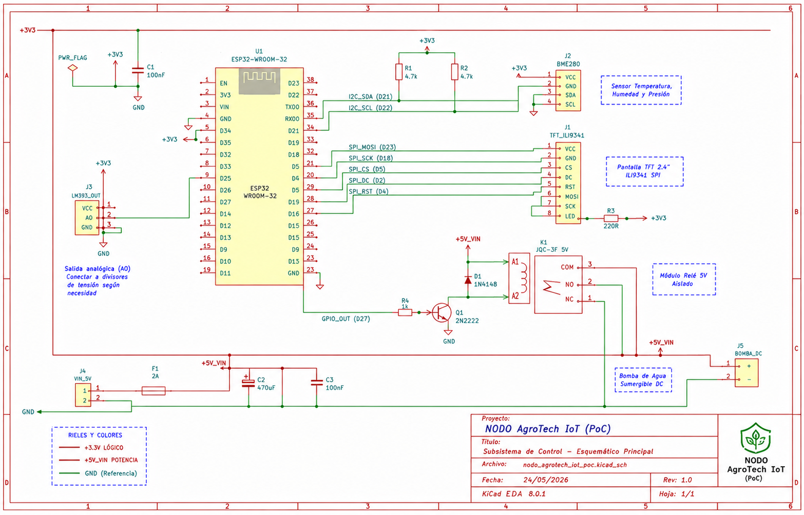
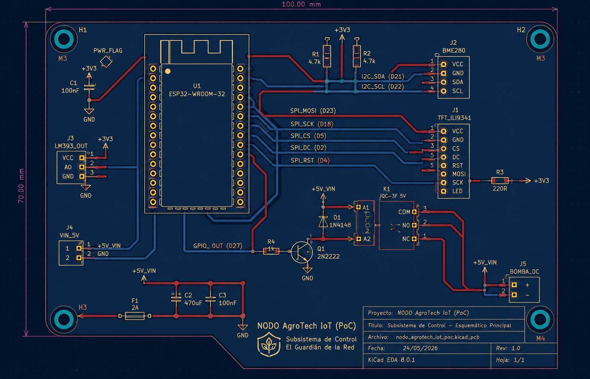

# AgroTech_Node: Sistema de Resiliencia Hídrica (PoC & MVP)

## Descripción del Proyecto
**AgroTech_Node** es un ecosistema IoT distribuido diseñado para la resiliencia hídrica en cultivos de flores. Este nodo implementa una arquitectura de **Edge Computing** con comunicación LoRa P2P para superar brechas de conectividad rural, integrando seguridad criptográfica y lógica de actuación local *fail-safe*. 

El objetivo principal es reducir el desperdicio de agua mediante la automatización basada en la demanda real del sustrato (capacidad de campo), utilizando sensores capacitivos de alta fidelidad y filtrado digital en el borde.

## Arquitectura de Hardware
El nodo está basado en el microcontrolador **ESP32-S3 (Heltec V3)**, optimizado para operaciones de larga duración mediante celdas fotovoltaicas y modos de bajo consumo (*Deep Sleep*).

### 1. Esquemático del Sistema
El diseño garantiza el aislamiento galvánico entre la etapa lógica (3.3V) y la etapa de potencia (5V) para proteger al MCU de transitorios inductivos.


### 2. Diseño de PCB
La placa ha sido ruteada para minimizar el ruido analógico en la línea del sensor capacitivo.


## Características Técnicas
* **Edge Computing:** Filtrado de ruido mediante promedio móvil (k=5) en el sensor capacitivo v1.2.
* **Resiliencia:** Lógica de actuación *fail-safe* (Normalmente Abierto); ante fallos de conexión, el sistema bloquea preventivamente el riego para proteger la integridad radicular.
* **HMI Industrial:** Interfaz local en pantalla TFT (ST7789) con paleta de colores de alto contraste (SCADA Style).
* **Conectividad:** Protocolo MQTT sobre transporte LoRa, con estructuras de tópicos jerárquicos para escalabilidad.

## Estructura del Repositorio
```text
├── kicad/            # Archivos fuente del esquemático y PCB (.net, .log)
├── include/          # Cabeceras de control (Sensors.h, Display.h, NetworkManager.h)
├── src/              # Código fuente principal (main.cpp)
├── platformio.ini    # Configuración de entorno y dependencias de librerías
└── AUTHORS.md        # Créditos y autoría del proyecto